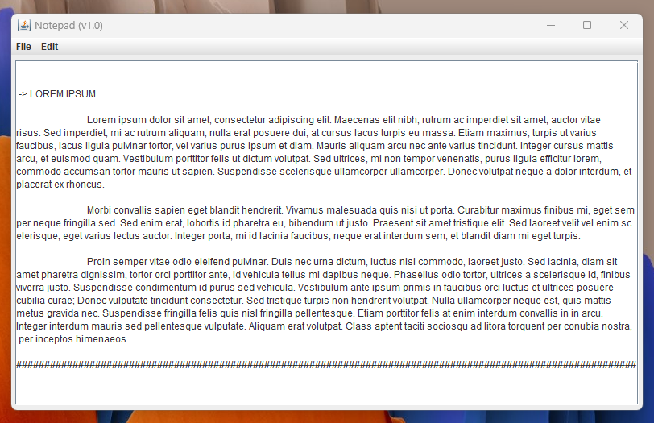
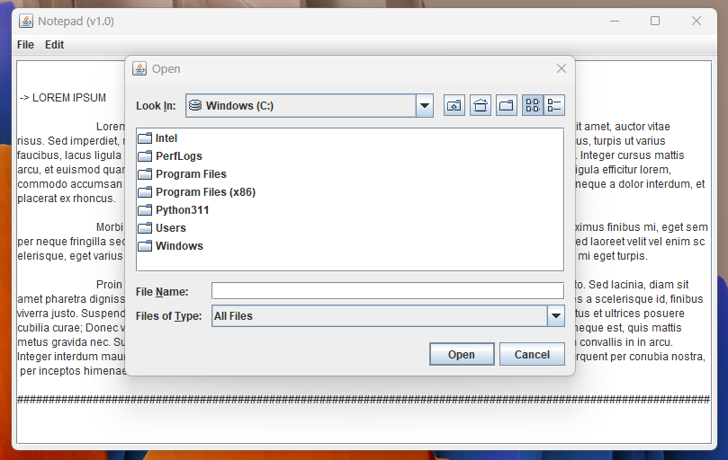
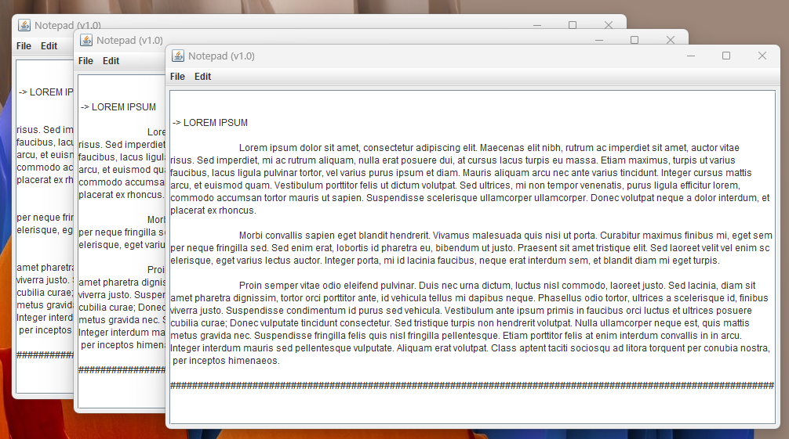

# TextEditor Application Readme

## Table of Contents
- [Introduction](#introduction)
- [Features](#features)
- [Requirements](#requirements)
- [Getting Started](#getting-started)
- [Usage](#usage)
- [Contributing](#contributing)
- [License](#license)

## Introduction
Welcome to the TextEditor Application! This Java Swing-based text editor is a simple yet powerful tool for creating, editing, and managing text files. It provides a user-friendly graphical interface and supports basic text editing operations.





## Features
- **User-Friendly Interface**: The application is built using Java Swing, providing an intuitive and easy-to-use interface.
- **Open and Save Files**: Open existing text files and save your work to new or existing files.
- **Text Editing**: Perform standard text editing operations like cut, copy, paste, undo, and redo.
- **Multi-Tab Support**: Open and edit multiple documents simultaneously in different tabs.
- **Cross-Platform**: The application is compatible with Windows, macOS, and Linux.

## Requirements
To run the TextEditor Application, you'll need the following:
- Java Development Kit (JDK) 8 or later installed on your system.
- A modern web browser to view the HTML documentation.

## Getting Started
1. Clone or download the TextEditor Application repository to your local machine.

2. Open a command prompt or terminal window and navigate to the project directory.

3. Compile the application by running the following command:
   ```
   javac TextEditor.java
   ```

4. Run the application with the following command:
   ```
   java TextEditor
   ```

5. The TextEditor Application will open, and you can start using it.

## Usage
- **Open a File**: Click the "Open" button and select a text file from your computer.
- **Save a File**: Click the "Save" button to save the current document.
- **Edit Text**: Use standard editing operations like cut, copy, paste, undo, and redo.

For more detailed information on how to use the TextEditor Application, please refer to the included HTML documentation.

## Contributing
We welcome contributions from the community! If you want to contribute to this project, please follow these steps:
1. Fork the repository.
2. Create a new branch for your feature or bug fix.
3. Make your changes and commit them.
4. Push your changes to your fork.
5. Create a pull request with a clear description of your changes.

We appreciate your contributions in making this text editor even better!

## License
This TextEditor Application is open-source and released under the MIT License. See the [LICENSE](LICENSE) file for more details. Feel free to use, modify, and distribute it according to the terms of the license.
